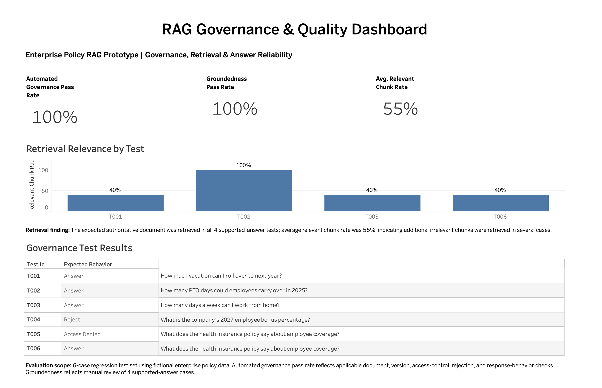

# Governed Enterprise Policy RAG Assistant

## Project Overview

This project is a hands-on prototype demonstrating how enterprise data governance principles can be applied to a Retrieval-Augmented Generation (RAG) application.

The prototype uses fictional Acme Financial Services policy documents to simulate an enterprise policy assistant. Users can ask questions about policies such as PTO, remote work, benefits, and travel.

The focus of the project is not only generating answers, but ensuring that the data used by the RAG system is governed throughout the lifecycle.

The prototype demonstrates controls for:

- Document ownership and metadata
- Policy versioning and effective dates
- Current vs. historical policy retrieval
- Data classification and access control
- Source-to-answer lineage
- Unsupported-question handling
- Grounded answer generation
- Deterministic source attribution
- Retrieval and response quality evaluation

## Governance & Quality Dashboard

The prototype includes a Tableau dashboard for monitoring governance controls, groundedness, and retrieval quality across the regression test set.

The dashboard intentionally separates governance-control success from retrieval quality. In the six-case prototype, all applicable automated governance checks passed after remediation, while the average relevant chunk rate was 55%, highlighting an opportunity to improve retrieval precision.

## Business Problem

Enterprise RAG applications may retrieve information from multiple documents, versions, and data sources. Without appropriate governance controls, a system could:

- Retrieve an outdated policy instead of the current approved version
- Expose restricted information to unauthorized users
- Generate an answer from irrelevant documents
- Provide an answer without reliable source attribution
- Generate unsupported information when the source data does not contain an answer

This prototype explores how traditional data governance concepts such as metadata management, ownership, classification, lineage, data quality, access control, and lifecycle management can be extended to a RAG workflow.

## RAG Architecture

The prototype follows this workflow:

Policy PDFs  
↓  
Text Extraction  
↓  
Governance Metadata  
↓  
Chunking  
↓  
Embeddings  
↓  
Chroma Vector Database  
↓  
Access and Metadata Filtering  
↓  
Temporal / Version Filtering  
↓  
Semantic Retrieval  
↓  
Governed Context  
↓  
Local LLM Generation  
↓  
Deterministic Source Attribution  
↓  
Evaluation and Monitoring

The application uses governance metadata throughout the retrieval process rather than relying only on semantic similarity.

## Governance Controls

### 1. Metadata and Ownership

Each policy is registered in a document catalog with metadata including document ID, document name, business owner, classification, version, status, effective date, expiration date, source system, and access group.

Metadata is preserved when documents are chunked so retrieved content can be traced back to its governing source.

### 2. Version and Temporal Governance

Current questions retrieve approved policies. Historical questions can retrieve retired policies when the policy was valid during the requested period.

For example:

- A current PTO question uses PTO Policy Version 3.0.
- A question about PTO rules in 2025 uses retired PTO Policy Version 2.0.

This prevents the latest policy from automatically being applied to historical questions.

### 3. Access Control

Retrieval is filtered based on the user's access group before restricted content is provided to the language model.

For example, the Health Insurance Policy is classified as confidential employee-benefits information and is available only to the Benefits access group in this prototype.

### 4. Unsupported Questions

Questions that cannot be supported by the governed policy corpus return an insufficient-information response rather than presenting unrelated retrieved documents as authoritative evidence.

### 5. Source Attribution

The language model generates the natural-language answer, while source attribution is added programmatically using retrieved governance metadata.

Example:

`Source: Health Insurance Policy, Version 1.7`

This reduces reliance on the language model for provenance information such as policy names and versions.

## Evaluation Framework

A six-case regression test set was created to evaluate both RAG behavior and governance controls.

The test scenarios include:

- Current-policy retrieval
- Historical-policy and version retrieval
- Remote-work policy retrieval
- Unsupported-question rejection
- Unauthorized access to a restricted policy
- Authorized access to a restricted policy

Evaluation combines automated governance checks with human review.

### Automated Checks

The automated evaluation tests:

- Expected document retrieval
- Expected policy version
- Access-control enforcement
- Unsupported-question rejection
- Access-denied response behavior
- Relevant chunk rate

### Human-Reviewed Checks

Generated answers for supported-answer scenarios are manually reviewed for:

- Groundedness — whether claims in the answer are supported by retrieved context
- Answer quality — whether the response correctly and clearly answers the question without introducing unsupported information

## Evaluation Results

The final six-case regression test produced the following results:

| Metric | Result |
|---|---|
| Expected document retrieval | 4 / 4 applicable tests passed |
| Correct policy version | 4 / 4 applicable tests passed |
| Manual groundedness review | 4 / 4 applicable tests passed |
| Manual answer-quality review | 4 / 4 applicable tests passed |
| Access-control enforcement | 1 / 1 applicable test passed |
| Access-denied response behavior | 1 / 1 applicable test passed |
| Unsupported-question rejection | 1 / 1 applicable test passed |
| Average relevant chunk rate | 55% |

The results should be interpreted within the scope of this small six-case prototype and should not be interpreted as 100% overall RAG accuracy.

### Retrieval Quality Finding

The expected authoritative document was retrieved in all four supported-answer scenarios. However, the average relevant chunk rate was 55%.

Individual relevant chunk rates were:

- T001 — 40%
- T002 — 100%
- T003 — 40%
- T006 — 40%

This indicates that the retriever consistently located the expected authoritative source, but several queries also retrieved irrelevant chunks. Improving retrieval precision is therefore an identified opportunity for future work.

## Example Governance Scenario

A historical PTO question demonstrates the interaction between semantic retrieval and governance metadata.

Question:

`How many PTO days could employees carry over in 2025?`

The vector database contains both the retired PTO Policy Version 2.0 and the current Version 3.0.

Temporal governance determines that Version 2.0 was effective during 2025. The system therefore answers using the historical policy:

`Employees could carry over up to 5 unused PTO days.`

For a current PTO question, Version 3.0 is used instead, which allows up to 10 unused PTO days.

This demonstrates why semantic similarity alone is insufficient for governed enterprise retrieval.

## Technology Stack

- Python
- PyPDF
- Pandas
- Sentence Transformers
- all-MiniLM-L6-v2 embeddings
- ChromaDB
- Ollama
- Llama 3.2 3B
- LangChain Text Splitters
- Tableau
- VS Code

The RAG workflow runs locally for this prototype. Ollama is used for local language-model inference, while ChromaDB provides persistent vector storage.

## Project Structure

rag-governance-project/

- data/policies/ — fictional enterprise policy documents
- governance/ — document catalog and governance rules
- src/ — ingestion, chunking, retrieval, vector-store, RAG, and validation logic
- evaluation/ — regression test set, evaluation script, and evaluation results
- outputs/ — persistent Chroma vector database
- README.md — project documentation

## Limitations and Future Improvements

This is a learning prototype built with a small fictional policy corpus and a six-case regression test set. It is not intended to represent a production enterprise RAG platform.

Current limitations include:

- Small document corpus and evaluation set
- Retrieval contains irrelevant chunks for several queries
- Unsupported-topic handling is simplified for the prototype
- Citation generation currently uses retrieved metadata and assumes a primary supporting source
- Access control uses simplified access groups rather than integration with an enterprise identity platform
- Groundedness and answer quality are manually reviewed
- Local LLM behavior may vary between runs

Potential future improvements include:

- Expanding the regression test set
- Introducing retrieval similarity thresholds
- Evaluating reranking to improve chunk precision
- Strengthening claim-to-source citation mapping
- Integrating enterprise identity and authorization controls
- Adding automated evaluation alongside human review
- Monitoring policy freshness and review dates
- Building alerts for governance-control failures

## Key Learning

The project demonstrates that governing a RAG application requires more than selecting an LLM or creating embeddings.

Reliable enterprise RAG depends on governing the information supplied to the model: identifying authoritative sources, preserving metadata and lineage, enforcing access controls, selecting valid document versions, measuring retrieval quality, and validating whether generated answers are supported by retrieved evidence.

The prototype applies familiar enterprise data-governance principles across the RAG lifecycle and demonstrates how Data Owner and data-governance responsibilities can extend into AI-enabled applications.